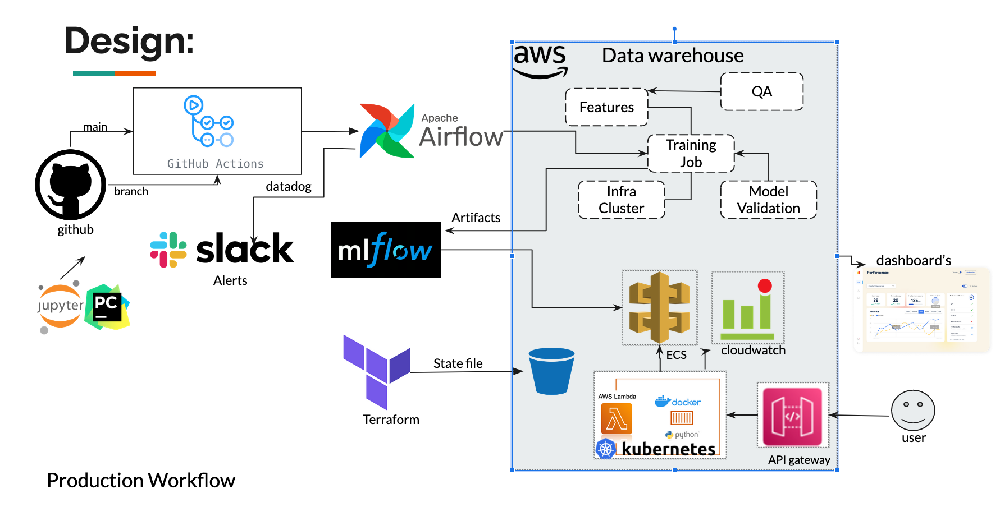

#  Current State:
### Local Training: 
Our project involves training our machine learning model locally due to time constraints and the need for simplicity.
### Artifact Storage: 
After training, artifacts are updated and versioned in MLflow, which is also running locally.
### Local Deployment: 
The model is deployed using a Flask API on a local machine.
### Manual Infrastructure: 
Currently, our infrastructure setup is manual, without the use of infrastructure as code.

# Production-Grade Pipeline for the use-case:
### Automated Workflows: 
We can aim to use GitHub Actions / CircleCI for continuous integration and deployment (CI/CD), which can automate the testing and deployment process.
### Monitoring: 
Integration with Datadog and Slack for real-time monitoring and alerts, helps ensuring quick response to issues. 
### Orchestration:
Apache Airflow is included for workflow orchestration, which can manage the pipeline's complex dependencies and scheduling. There are other tools like prefact or step-functions which can also be deployed.
### Infrastructure as Code: 
Terraform/CF can be used as infrastructure as code for provisioning and managing cloud resources. AWS/GCP resources.
### Cloud Services:
Deployment is intended for a Kubernetes cluster or AWS SageMaker, which offers scalability and robustness.
### Robust Data Handling:
AWS components like a data warehouse, ECS, CloudWatch, and Lambda functions for scalable, serverless executions.
### Dashboards:
Grafana or plotly can be used to build custom dashboards
### Testing:
Functional tests for training and prediction systems, behavioral testing (Invariance and directionality tests), A/B testing
Unit Testing, can be designed and deployed.
### Contract/Documentation:
Every piece of model decision-making and each step in the pipeline is well-documented. Helps with compliance's and security questions.

# Future-steps/Incremental approach: 

Production grade pipeline is a end state (north star)
start by implementing one tool at a time into MVP
Like adding Mlflow, Data validation, model performance monitoring, alerts
